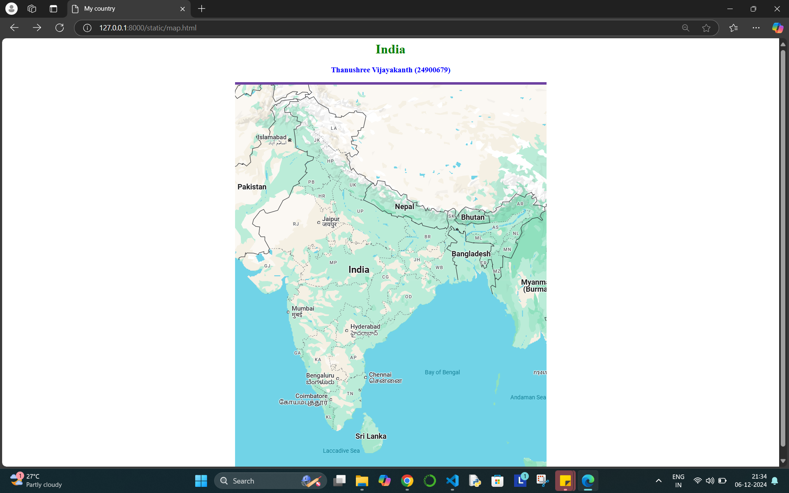
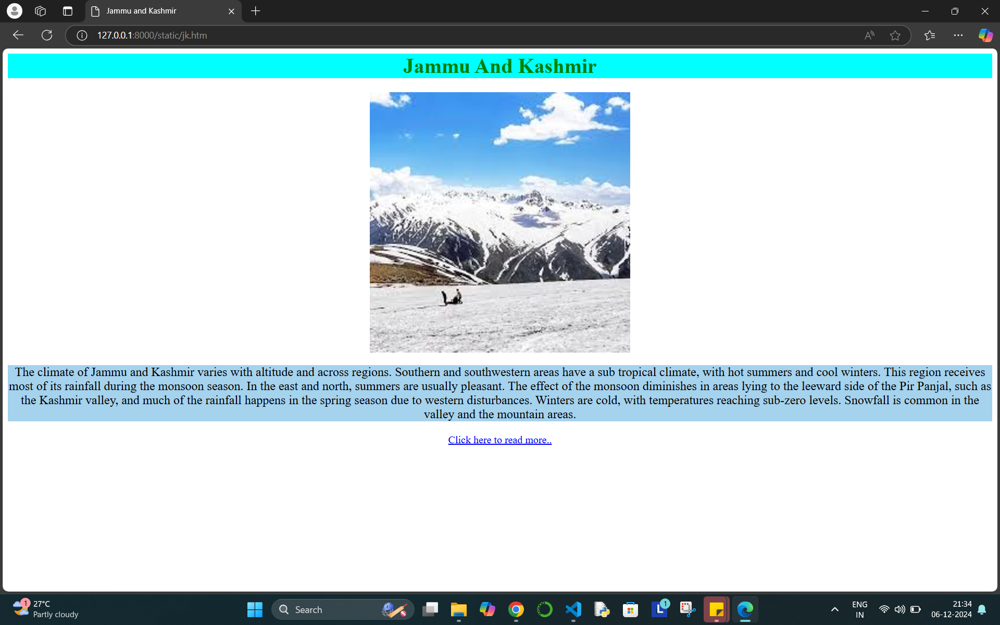
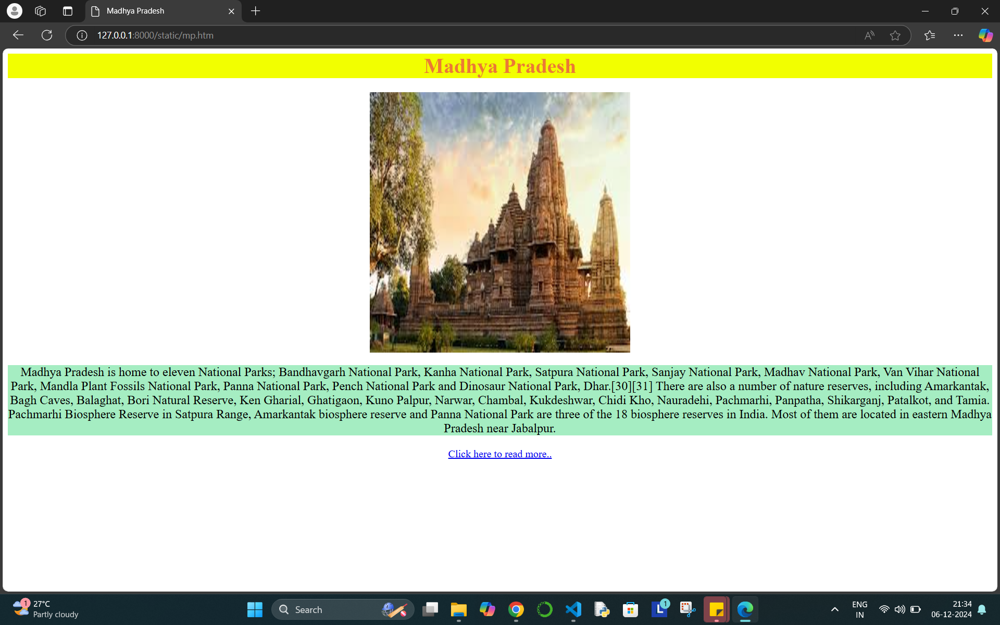
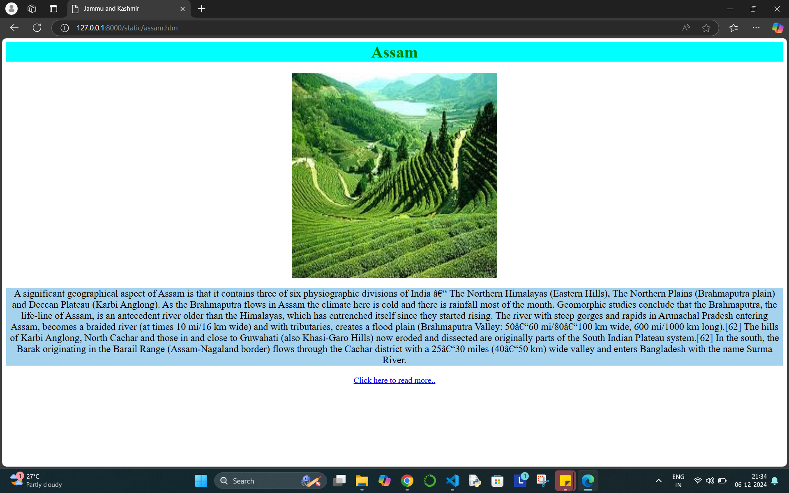
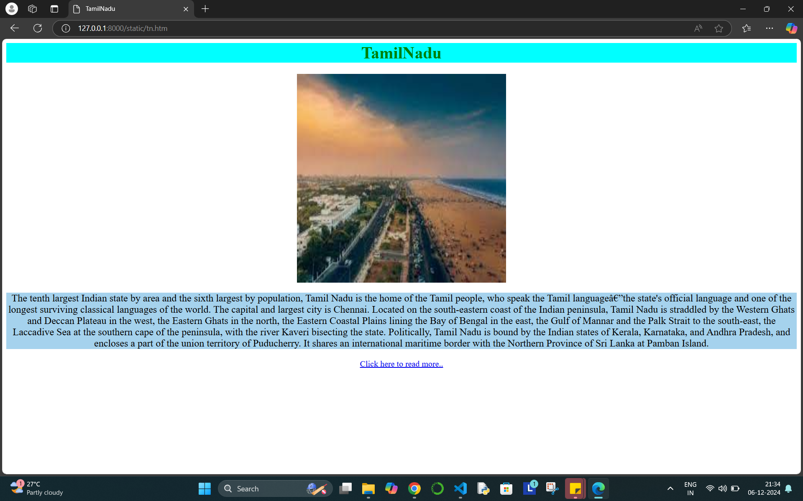
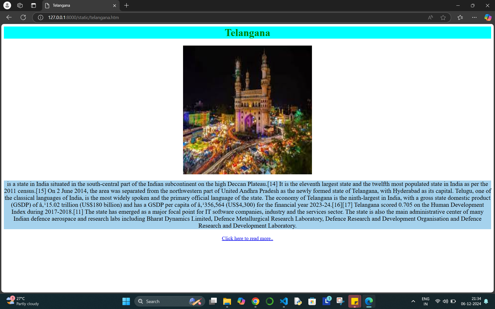

# Ex04 Places Around Me
# Date:9.11.2024
# AIM
To develop a website to display details about the places around my house.

# DESIGN STEPS
## STEP 1
Create a Django admin interface.

## STEP 2
Download your city map from Google.

## STEP 3
Using <map> tag name the map.

## STEP 4
Create clickable regions in the image using <area> tag.

## STEP 5
Write HTML programs for all the regions identified.

## STEP 6
Execute the programs and publish them.

# CODE
```
map.html

<html>
    <head>
        <title>My country</title>
    </head>
    <body>
        <h1 align="center" style="color: green;">India</h1>
        <h3 align="center" style="color: blue">Thanushree Vijayakanth (24900679)</h3>
        
        <center>
            
            <map name="mycountry"><area target="" alt="Jammu &amp; Kashmir" title="Jammu &amp; Kashmir" href="jk.htm" coords="189,183,149,156,141,115,159,95,119,62,154,44,189,34,246,84,312,73,318,81,309,110,296,130,283,144,300,165,285,180,269,175,225,154,198,182" shape="poly">
                <area target="" alt="TamilNadu" title="TamilNadu" href="tn.htm" coords="238,845,241,812,237,791,225,770,217,754,251,745,249,729,256,723,270,732,315,704,318,723,313,733,309,754,306,790,256,850" shape="poly">
                <area target="" alt="Madhya Pradesh" title="Madhya Pradesh" href="mp.htm" coords="328,491,229,491,220,505,161,479,166,450,180,425,185,396,199,425,231,415,231,395,242,386,220,375,265,344,287,358,266,388,271,411,282,410,275,383,303,393,317,383,323,394,356,394,374,405,377,428,353,431,364,445,351,463,336,469" shape="poly">
                <area target="" alt="Telangana" title="Telangana" href="telangana.htm" coords="245,640,248,579,269,536,308,547,339,594,336,610,301,622,289,638,259,644" shape="poly">
                <area target="" alt="Assam" title="Assam" href="assam.htm" coords="558,358,562,345,660,339,677,319,714,312,715,328,663,369,640,411,623,414,632,379,624,366,599,372,564,373" shape="poly">
            </map>

            </map>
            
        </center>
    </body>
</html>

assam.htm

<html>
    <head><title>Jammu and Kashmir</title></head>

<body>
    <h1 align="center" style="color: green; background-color: aqua;">Assam</h1>
    <center>
    
    <big><p style="background-color: rgb(165, 210, 237);">A significant geographical aspect of Assam is that it contains three of six physiographic divisions of India – The Northern Himalayas (Eastern Hills), The Northern Plains (Brahmaputra plain) and Deccan Plateau (Karbi Anglong). As the Brahmaputra flows in Assam the climate here is cold and there is rainfall most of the month. Geomorphic studies conclude that the Brahmaputra, the life-line of Assam, is an antecedent river older than the Himalayas, which has entrenched itself since they started rising. The river with steep gorges and rapids in Arunachal Pradesh entering Assam, becomes a braided river (at times 10 mi/16 km wide) and with tributaries, creates a flood plain (Brahmaputra Valley: 50–60 mi/80–100 km wide, 600 mi/1000 km long).[62] The hills of Karbi Anglong, North Cachar and those in and close to Guwahati (also Khasi-Garo Hills) now eroded and dissected are originally parts of the South Indian Plateau system.[62] In the south, the Barak originating in the Barail Range (Assam-Nagaland border) flows through the Cachar district with a 25–30 miles (40–50 km) wide valley and enters Bangladesh with the name Surma River.</p>
    </big>
    <a href="https://en.wikipedia.org/wiki/Assam">Click here to read more.. </a>
    </center>
</body>

</html>


jk.htm

<html>
    <head><title>Jammu and Kashmir</title></head>

<body>
    <h1 align="center" style="color: green; background-color: aqua;">Jammu And Kashmir</h1>
    <center>
    
    <big><p style="background-color: rgb(165, 210, 237);">The climate of Jammu and Kashmir varies with altitude and across regions. Southern and southwestern areas have a sub tropical climate, with hot summers and cool winters. This region receives most of its rainfall during the monsoon season. In the east and north, summers are usually pleasant. The effect of the monsoon diminishes in areas lying to the leeward side of the Pir Panjal, such as the Kashmir valley, and much of the rainfall happens in the spring season due to western disturbances. Winters are cold, with temperatures reaching sub-zero levels. Snowfall is common in the valley and the mountain areas.</p>
    </big>
    <a href="https://en.wikipedia.org/wiki/Jammu_and_Kashmir_(union_territory)">Click here to read more.. </a>
    </center>
</body>

</html>


madhya.htm

<html>
    <head><title>Madhya Pradesh</title></head>

<body>
    <h1 align="center" style="color: hsl(22, 83%, 57%); background-color: #f2ff00;">Madhya Pradesh</h1>
    <center>
    
    <big><p style="background-color: rgb(165, 237, 194);">Madhya Pradesh is home to eleven National Parks; Bandhavgarh National Park, Kanha National Park, Satpura National Park, Sanjay National Park, Madhav National Park, Van Vihar National Park, Mandla Plant Fossils National Park, Panna National Park, Pench National Park and Dinosaur National Park, Dhar.[30][31]

        There are also a number of nature reserves, including Amarkantak, Bagh Caves, Balaghat, Bori Natural Reserve, Ken Gharial, Ghatigaon, Kuno Palpur, Narwar, Chambal, Kukdeshwar, Chidi Kho, Nauradehi, Pachmarhi, Panpatha, Shikarganj, Patalkot, and Tamia. Pachmarhi Biosphere Reserve in Satpura Range, Amarkantak biosphere reserve and Panna National Park are three of the 18 biosphere reserves in India. Most of them are located in eastern Madhya Pradesh near Jabalpur.</p>
    </big>
    <a href="https://en.wikipedia.org/wiki/Madhya_Pradesh">Click here to read more.. </a>
    </center>
</body>

</html>


telangana.htm

<html>
    <head><title>Telangana</title></head>

<body>
    <h1 align="center" style="color: green; background-color: aqua;">Telangana</h1>
    <center>
    
    <big><p style="background-color: rgb(165, 210, 237);">is a state in India situated in the south-central part of the Indian subcontinent on the high 
        Deccan Plateau.[14] It is the eleventh largest state and the twelfth most populated state in India as per the 2011 census.[15] On 2 June 2014, the area was separated 
        from the northwestern part of United Andhra Pradesh as the newly formed state of Telangana, with Hyderabad as its capital. Telugu, one of the classical languages of India, 
        is the most widely spoken and the primary official language of the state.

        The economy of Telangana is the ninth-largest in India, with a gross state domestic product (GSDP) of ₹15.02 trillion (US$180 billion) and has a GSDP per capita of ₹356,564 
        (US$4,300) for the financial year 2023-24.[16][17] Telangana scored 0.705 on the Human Development Index during 2017-2018.[11]
        
        The state has emerged as a major focal point for IT software companies, industry and the services sector. The state is also the main administrative center of many Indian
         defence aerospace and research labs including Bharat Dynamics Limited, Defence Metallurgical Research Laboratory, Defence Research 
        and Development Organisation and Defence Research and Development Laboratory.</p>
    </big>
    <a href="https://en.wikipedia.org/wiki/Telangana">Click here to read more.. </a>
    </center>
</body>

</html>

tn.htm

<html>
    <head><title>TamilNadu</title></head>

<body>
    <h1 align="center" style="color: green; background-color: aqua;">TamilNadu</h1>
    <center>
    
    <big><p style="background-color: rgb(165, 210, 237);">The tenth largest Indian state by area and the sixth largest by population, Tamil Nadu is the home of the Tamil people, who speak the
         Tamil language—the state's official language and one of the longest surviving classical languages of the world. The capital and largest city is Chennai.

        Located on the south-eastern coast of the Indian peninsula, Tamil Nadu is straddled by the Western Ghats and Deccan Plateau in the west, the Eastern Ghats in the north, the Eastern 
        Coastal Plains lining the Bay of Bengal in the east, the Gulf of Mannar and the Palk Strait to
         the south-east, the Laccadive Sea at the southern cape of the peninsula, with the river Kaveri bisecting the state. Politically, Tamil Nadu is bound by 
        the Indian states of Kerala, Karnataka, and Andhra Pradesh, and encloses a part of the union territory of Puducherry. It shares
         an international maritime border with the Northern Province of Sri Lanka at Pamban Island.</p>
    </big>
    <a href="https://en.wikipedia.org/wiki/Tamil_Nadu">Click here to read more.. </a>
    </center>
</body>
</html>

```

# OUTPUT






# RESULT
The program for implementing image maps using HTML is executed successfully.
